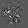
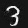

# Generating Adversarial Inputs

This project contains code for generating adversarial inputs to a neural network. Each example input is modified by computing the gradient of the network's output with respect to its inputs, then slightly perturbing along these gradients, using the method suggested in [Goodfellow et al. (2015)](https://arxiv.org/abs/1412.6572).

This project contains an example network (defined in `model.py`) trained to recognize different digits using the MNIST dataset in `training.py`. It also contains code in `data_poisoning.py` to generate examples meant to fool the specific model that has been trained. The goal is to generate examples that still look like their true class to a human onlooker.

## Example

Original testing image

Gradient of loss function with respect to input

Edited adversary example, classified as 9
